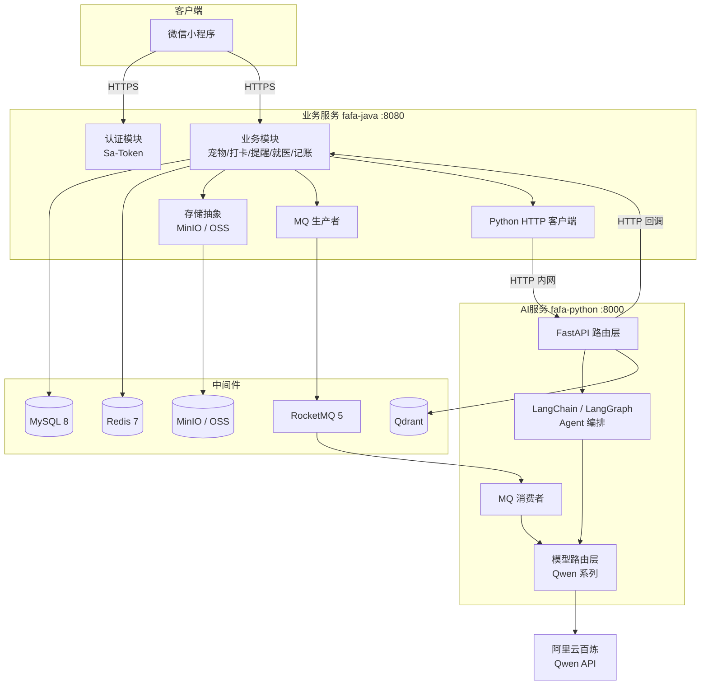
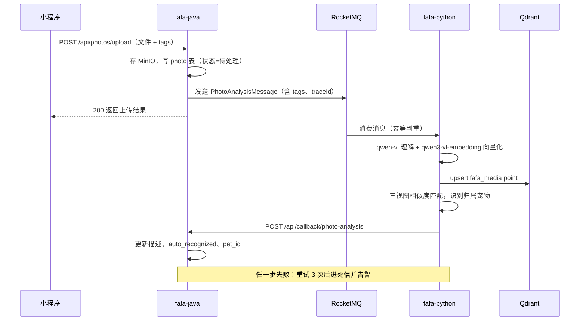

# FaFa 技术选型与项目框架搭建

> 版本：V1.0
> 更新时间：2026-08
> 文档类型：技术架构文档（技术选型 + 脚手架基线）
> 上游文档：[FaFa产品功能设计-最终版.md](./FaFa产品功能设计-最终版.md)

---

## 一、设计概述

### 1.1 目的与范围

本文档定义 FaFa 宠物生命周期管理小程序后端的技术选型基线、系统架构、双服务框架结构、中间件使用规范、服务间通信契约、日志与可观测性方案，以及脚手架落地的里程碑步骤。

覆盖范围：

- fafa-java 业务服务（端口 8080）
- fafa-python AI 服务（端口 8000）
- 中间件：MySQL、Redis、Qdrant、RocketMQ、MinIO（生产升级 OSS）

不覆盖：具体业务接口字段设计（见产品功能设计文档）、微信小程序前端、部署运维的详细 CI/CD 流程。

### 1.2 上游需求追溯

| 产品需求（来自最终版功能设计） | 对应技术能力 |
|------|------|
| 宠物档案、日常打卡、提醒、成长档案、就医/记账 | fafa-java 业务 CRUD + MySQL |
| 素材上传 + tags + AI 语义检索 | MinIO/OSS 存储 + RocketMQ 异步 + Python 向量化 + Qdrant |
| 宠物个体识别（三视图向量匹配） | qwen3-vl-embedding + Qdrant fafa_pet_profiles 集合 |
| AI 助手、报告生成、异常推送 | LangChain/LangGraph Agent + Qwen 系列模型 |
| 会员限额（AI 检索次数、存储空间） | Redis 计数 + Sa-Token 会话 |

### 1.3 设计约束

| 约束 | 来源 |
|------|------|
| 单体架构，不做微服务拆分 | 用户指定 `[Data-backed]` |
| Java 负责业务场景，Python 负责 AI 场景 | 用户指定 `[Data-backed]` |
| AI 模型全部采用阿里云百炼 Qwen 系列 | 用户指定 `[Data-backed]` |
| 日志暂时直接输出到外部文件夹 | 用户指定 `[Data-backed]` |
| 开发/测试用 MinIO，生产升级 OSS | 用户指定 `[Data-backed]` |
| 视频生成能力暂不接入，预留 MiniMax H3 第三方 API | 用户指定 `[Data-backed]` |

### 1.4 术语

| 术语 | 含义 |
|------|------|
| 百炼 / DashScope | 阿里云模型服务平台，Qwen 系列模型的调用入口 |
| DDD | 领域驱动设计，本项目采用其分层结构（接口层/应用层/领域层/基础设施层） |
| Qdrant | 开源向量数据库，存储照片与宠物三视图的嵌入向量 |
| 三视图 | 宠物创建时上传的头像、正面照、侧面照，用于个体识别 |

---

## 二、总体架构

### 2.1 架构图



架构图说明：

- 小程序只与 fafa-java 通信，fafa-python 不对外暴露，仅接受 fafa-java 的内网 HTTP 调用与 RocketMQ 消息。8000 端口在任何环境都不得暴露公网 `[Expert judgment]`。
- 重 AI 负载（照片视觉理解、向量化）走 RocketMQ 异步链路；轻 AI 负载（语义检索、对话）走同步 HTTP。
- 存储层在 Java 侧抽象为统一接口，开发/测试指向 MinIO，生产切换 OSS，业务代码无感知。

### 2.2 组件职责与边界

| 组件 | 拥有 | 明确不负责 |
|------|------|-----------|
| fafa-java | 用户认证、全部业务 CRUD、提醒调度、会员限额、文件存储、MQ 生产 | 模型调用、向量计算、AI 推理 |
| fafa-python | 模型调用与编排、视觉理解、向量化、向量检索、AI 对话、报告生成 | 业务数据写库（除 Qdrant 外不写 MySQL 业务表）、用户认证 |
| MySQL | 全部业务数据的唯一事实来源 | 向量存储 |
| Redis | Sa-Token 会话、限额计数、热点缓存、分布式锁 | 持久化业务数据 |
| Qdrant | 媒体向量（fafa_media）、宠物三视图向量（fafa_pet_profiles） | 业务数据 |
| RocketMQ | Java → Python 的异步 AI 任务投递 | 业务事件总线（当前阶段不承载业务事件） |

### 2.3 关键数据流

两条主链路，详细时序见第七章：

1. 照片异步理解链路：上传 → 存 MinIO → 发 MQ → Python 消费 → 视觉理解 + 向量化 + 个体识别 → 写 Qdrant → 回调 Java 更新 MySQL。
2. AI 对话同步链路：小程序 → Java 转发 → Python Agent（LangGraph 编排工具调用）→ 查 MySQL/Qdrant → 流式返回。

---

## 三、技术选型

### 3.1 Java 服务

| 技术 | 版本基线 | 选型理由 | 依据 |
|------|---------|---------|------|
| Java | 21（LTS） | 虚拟线程正式特性；长期支持版本 | `[Data-backed]` 用户指定 |
| Spring Boot | 3.x（建议 3.5+，以搭建时最新稳定版为准） | Jakarta 命名空间、虚拟线程原生支持（3.2+）、与 Java 21 配套 | `[To be confirmed]` 具体小版本 |
| 架构风格 | 单体 + DDD 四层分包 | 单人/小团队快速迭代，避免微服务运维成本；DDD 分包保证业务边界清晰，为将来拆分留缝 | `[Expert judgment]` |
| MyBatis-Plus | 3.5.x（spring-boot3-starter） | CRUD 提效、逻辑删除、分页、自动填充；团队熟悉 | `[Data-backed]` 用户指定 |
| Druid | druid-spring-boot-3-starter | 连接池监控面板、SQL 防火墙；用户指定 | `[Data-backed]` |
| Sa-Token | spring-boot3-starter | 微信登录态管理轻量；会话存 Redis 天然支持多端 | `[Data-backed]` 用户指定 |
| Redisson | 最新稳定版 | 分布式锁（提醒调度防重、限额扣减原子性） | `[Data-backed]` 用户指定 |
| Hutool | 最新稳定版 | 工具类集合（BeanUtil、StrUtil、日期），减少样板代码 | `[Data-backed]` 用户指定 |
| Knife4j | 4.x（openapi3-jakarta） | 接口文档与在线调试，开发期开启、生产关闭 | `[Data-backed]` 用户指定 |
| RocketMQ | rocketmq-spring-boot-starter 2.3.x | 异步 AI 任务解耦；阿里云生态兼容 | `[Expert judgment]` |
| MinIO SDK + 阿里云 OSS SDK | 最新稳定版 | 开发用 MinIO、生产用 OSS，通过存储抽象接口切换 | `[Expert judgment]` |
| Flyway | Spring Boot 内置版本 | 数据库版本化管理，已有 V1.x 迁移脚本延续 | `[Data-backed]` 已有实践 |
| Micrometer + Actuator | Spring Boot 内置 | 健康检查与 Prometheus 指标 | `[Expert judgment]` |
| Lombok | Spring Boot 管理版本 | 减少 POJO 样板 | `[Expert judgment]` |

### 3.2 Python 服务

| 技术 | 版本基线 | 选型理由 | 依据 |
|------|---------|---------|------|
| Python | 3.11+（与现有环境一致） | LangChain 生态兼容性 | `[To be confirmed]` 3.11 或 3.12 |
| FastAPI + uvicorn | 最新稳定版 | 异步高性能、Pydantic 契约校验、自动 OpenAPI 文档 | `[Data-backed]` 用户指定 |
| LangChain | 最新稳定版 | 模型调用抽象、工具封装、对话记忆 | `[Data-backed]` 用户指定 |
| LangGraph | 最新稳定版 | AI 助手的多步工具编排（状态图），比纯 Chain 更可控 | `[Data-backed]` 用户指定 |
| DashScope OpenAI 兼容接口 | `https://dashscope.aliyuncs.com/compatible-mode/v1` | LangChain 的 ChatOpenAI/OpenAIEmbeddings 可直连百炼，无需自研 SDK 适配 | `[Expert judgment]` |
| qdrant-client | 最新稳定版 | 向量读写 | `[Data-backed]` 已有实践 |
| loguru | 最新稳定版 | 结构化日志，输出到外部文件夹 | `[Data-backed]` 已有实践 |
| httpx | 最新稳定版 | 异步 HTTP 客户端（回调 Java、调百炼） | `[Expert judgment]` |
| rocketmq 客户端 | — | 仅 Linux 可用；Windows 开发环境用 HTTP 回调链路替代 | `[Data-backed]` 已知约束 |

### 3.3 AI 模型分工（阿里云百炼 Qwen 系列）

| 用途 | 模型 | 说明 |
|------|------|------|
| 轻量对话 / 意图识别 / 标签生成 | qwen-flash、qwen-turbo | 用户指定的主力轻量模型。用户原文提到 "qwen3.7-flash"，该型号名需在百炼控制台核实实际模型 ID `[To be confirmed]` |
| 复杂推理 / Agent 编排 / 报告生成 | qwen-plus 或更高档位 | 按成本与效果实测后定档 `[To be confirmed]` |
| 图像 / 视频理解 | qwen-vl 系列 | 照片描述、包装成分表识别、病历 OCR |
| 多模态嵌入 | qwen3-vl-embedding（1024 维） | 已上线，照片与三视图统一使用，Qdrant 两个集合维度一致 |
| 文本嵌入 | qwen3-embedding 或 text-embedding 系列 | 事件文本、日记向量化 `[To be confirmed]` 实测选型 |
| 视频生成 | 预留 | 暂不接入；后期评估 MiniMax H3 第三方 API，模型路由层预留 provider 扩展点 `[Data-backed]` 用户指定 |

模型路由层的设计要求：所有模型调用收敛到统一客户端，业务代码只声明「用途」（如 `Purpose.CHAT_LIGHT`、`Purpose.VISION`），不直接写模型名。模型名与参数配置在配置文件中维护，换模型不改代码。

### 3.4 中间件

| 中间件 | 版本基线 | 用途 |
|------|---------|------|
| MySQL | 8.x | 业务数据唯一事实来源 |
| Redis | 7.x | 会话、限额计数、缓存、分布式锁 |
| Qdrant | 最新稳定版 | 向量检索（fafa_media、fafa_pet_profiles） |
| RocketMQ | 5.x | Java → Python 异步 AI 任务 |
| MinIO / 阿里云 OSS | — | 对象存储，开发测试 MinIO、生产 OSS |

---

## 四、Java 服务框架设计

### 4.1 DDD 分层与包结构

单 Maven 模块，包级 DDD 分层。依赖方向单向：interfaces → application → domain ← infrastructure（基础设施实现领域层定义的仓储接口，依赖倒置）。domain 层不依赖任何框架注解之外的外部技术。

```
com.fafa
├── FaFaApplication.java
├── interfaces                    # 接口层：面向小程序
│   ├── controller                # REST 控制器，只做参数校验与协议转换
│   ├── dto                       # 请求/响应 DTO
│   └── assembler                 # DTO <-> 领域对象转换
├── application                   # 应用层：用例编排
│   ├── service                   # 应用服务（事务边界）
│   ├── dto                       # Command / Query / Result
│   └── subscriber                # 领域事件订阅
├── domain                        # 领域层：业务规则核心
│   ├── model                     # 聚合根、实体、值对象（pet/record/reminder/medical/expense 子包）
│   ├── repository                # 仓储接口（只定义，不实现）
│   ├── service                   # 领域服务
│   └── event                     # 领域事件
└── infrastructure                # 基础设施层
    ├── persistence               # DO / Mapper / Converter / RepositoryImpl
    ├── oss                       # StorageService 抽象 + MinIO/OSS 实现
    ├── mq                        # 生产者、消息体定义
    ├── client                    # PythonAiClient 等外部服务客户端
    ├── wechat                    # 微信 code2Session
    └── config                    # Sa-Token / MyBatis-Plus / Druid / Knife4j / 线程配置
```

### 4.2 关键机制约定

统一响应与异常：

- 所有接口返回 `Result<T>`（code / message / data），全局异常处理器统一捕获。
- 业务异常抛 `BusinessException(错误码)`，错误码按模块分段（如 10xxx 用户、20xxx 宠物、30xxx 记录）。
- 控制器不写 try-catch，不直接访问 Mapper。

Sa-Token：

- 微信 code 换 openid 后登录，token 存 Redis，会话超时与续期按 Sa-Token 默认配置调整。
- 拦截规则：`/auth/wechat/login`、`/actuator/**`、Knife4j 文档路径放行，其余全部鉴权。
- 登录用户 ID 通过 `StpUtil.getLoginIdAsLong()` 获取，控制器层统一注入。

MyBatis-Plus：

- 所有 DO 继承统一基类：`id`（bigint 雪花）、`createdAt`、`updatedAt`、`isDeleted`。
- 逻辑删除：`@TableLogic`，仅用户、宠物、照片、提醒等需要回溯的表启用；行为流水类表按需。
- 自动填充：MetaObjectHandler 填充创建/更新时间。
- 分页：统一 PaginationInnerInterceptor。
- 手写 XML SQL 必须显式带 `is_deleted = 0` 条件（MP 不拦截自定义 SQL）。

Druid：

- 开启监控 Servlet 与 StatFilter，仅开发/测试环境暴露监控页。
- 连接池参数按单机小规模起步（initial 5 / min 5 / max 20），压测后再调。

Redisson：

- 分布式锁使用场景：提醒到期处理防重、会员限额扣减、同一照片重复消费防护。
- 锁 key 命名 `fafa:lock:{模块}:{业务id}`，必须设置 leaseTime，禁止裸用 `lock()` 不带超时。

虚拟线程：

- `spring.threads.virtual.enabled=true`，Tomcat 请求处理与 `@Async` 走虚拟线程。
- 注意事项：业务代码避免长时间持有 `synchronized`（钉住载体线程），需要互斥时用 `ReentrantLock`；ThreadLocal 在虚拟线程下可用但避免存放大对象。
- RocketMQ 客户端、Druid 内部线程仍为平台线程，不受影响。

Knife4j：

- dev/test 环境开启，prod 环境通过 `knife4j.production=true` 关闭。
- 按模块分组（auth / pet / record / photo / reminder / medical / expense）。

Hutool 使用边界：

- 允许：StrUtil、CollUtil、BeanUtil（含 CopyOptions）、DateUtil、IdUtil。
- 避免：用 Hutool HTTP 客户端调用 Python 服务（统一走 infrastructure/client 中封装的 RestClient，便于统一超时、重试与 traceId 传递）。

### 4.3 配置与 Profile

```
application.yml          # 公共配置
application-dev.yml      # 本地开发：MinIO、本机/内网中间件、Knife4j 开
application-test.yml     # 测试：MinIO、Knife4j 开
application-prod.yml     # 生产：OSS、Knife4j 关、日志级别收紧
```

敏感配置（百炼 API Key、数据库口令、OSS 密钥）不进代码库，dev 用本地 `application-local.yml`（gitignore）或环境变量注入。

---

## 五、Python AI 服务框架设计

### 5.1 目录结构

```
fafa-python/
├── main.py                       # FastAPI 入口，路由挂载
├── app/
│   ├── api/                      # 路由层：photo / pet / vector / chat / callback / record
│   ├── service/                  # 业务编排：photo_service / chat_service / report_service
│   ├── agent/                    # LangGraph 图定义、工具注册（chat 场景）
│   ├── core/
│   │   ├── config.py             # pydantic-settings，按环境读取
│   │   ├── llm.py                # 模型路由层：统一 LLM 客户端 + 用途->模型映射
│   │   ├── qdrant.py             # 集合管理、point id 规范
│   │   └── logging.py            # loguru 配置，traceId 注入
│   ├── consumer/                 # RocketMQ 消费者（仅 Linux 启用）
│   └── schemas/                  # Pydantic 请求/响应模型（snake_case）
├── scripts/                      # 迁移与运维脚本
└── logs/                         # 日志输出目录（可由 LOG_PATH 覆盖）
```

### 5.2 框架约定

- 路由前缀扁平化：`/api/{domain}/{resource}`，禁止双重前缀（如 `/api/photo/photos/`）。
- 请求/响应体一律 snake_case；与 Java 的消息体约定见 7.3。
- Python 服务不做用户鉴权，但所有接口校验必填业务参数（user_id 等），依赖网络隔离保证安全。
- 健康检查：`GET /health`，返回版本与 Qdrant/百炼连通状态。

### 5.3 模型路由层

`core/llm.py` 提供唯一入口：

```python
get_chat_model(purpose: Purpose) -> BaseChatModel
get_embedding_model(purpose: Purpose) -> Embeddings
```

用途枚举（CHAT_LIGHT / CHAT_DEEP / VISION / EMBED_MULTIMODAL / EMBED_TEXT / VIDEO_GEN）到模型名的映射放在配置文件，`VIDEO_GEN` 当前返回占位实现并抛出 NotEnabled 异常，为 MiniMax H3 预留 provider 扩展点。

### 5.4 LangChain / LangGraph 定位

- LangChain：模型调用、Prompt 模板、工具（Tool）封装、对话历史存储。
- LangGraph：AI 助手主链路。状态图节点包括：意图分类 → 工具调用（查记录/查照片/查就医档案等，工具通过 HTTP 回调 Java 只读接口取数）→ 回答生成 → 敏感边界检查（不输出医疗诊断结论）。
- 工具清单与产品文档第十一章 AI 数据查询工具链保持一致，工具定义集中在 `agent/tools/`。

### 5.5 Qdrant 使用规范

| 集合 | 内容 | 向量 |
|------|------|------|
| fafa_media | 照片/视频素材 | qwen3-vl-embedding，1024 维 |
| fafa_pet_profiles | 宠物三视图 | 同上 |

- Point ID 统一由 embedding_id 经 uuid5 确定性生成，禁止随机 UUID（保证幂等 upsert）。
- Payload 必含：user_id、media_type、tags、taken_at；pet_id 可空。
- 删除素材/宠物时必须同步删除对应 point，由 Java 侧触发。

---

## 六、中间件设计

### 6.1 MySQL

- 库名 `fafa`，字符集 utf8mb4。
- 表名/字段名 snake_case；每张表含 `id`、`created_at`、`updated_at`；需要软删除的表加 `is_deleted`。
- 迁移脚本命名 `V{大版本}.{序号}__{描述}.sql`（延续现有 V1.x 风格），由 Flyway 启动时执行。
- 金额类字段用 decimal，不用 float。

### 6.2 Redis

Key 命名规范 `fafa:{模块}:{业务}:{标识}`，示例：

| Key | 用途 | TTL |
|------|------|-----|
| `fafa:auth:token:{token}` | Sa-Token 会话（框架托管） | 随会话 |
| `fafa:quota:ai-search:{userId}:{yyyyMM}` | 会员 AI 检索月限额计数 | 当月 |
| `fafa:quota:storage:{userId}` | 存储用量缓存 | 1h |
| `fafa:lock:reminder:{reminderId}` | 提醒处理防重锁 | 30s |

限额扣减用 Lua 脚本或 Redisson 原子操作保证不超发。

### 6.3 RocketMQ

命名规范：

| 项 | 规范 | 示例 |
|------|------|------|
| Topic | `fafa_{业务}_topic` | `fafa_photo_analysis_topic` |
| Tag | 按子类型 | `photo` / `video` / `pet_profile` |
| Consumer Group | `fafa_python_{业务}_group` | `fafa_python_photo_group` |

消息约定：

- 消息体 JSON，字段 camelCase（与 Java 序列化一致），Python 消费端做 camelCase → snake_case 映射。
- 每条消息携带 `messageId`（幂等键）与 `traceId`。
- 消费端必须幂等：以 messageId 或 photoId 判重，重复投递直接跳过。
- 消费失败重试 3 次后进入死信，死信由日志告警人工处理（当前规模不做自动补偿）。

### 6.4 MinIO / OSS

- Bucket 规划：`fafa-media`（素材）、`fafa-avatar`（头像，可合并进 media 用路径区分，起步单 bucket）。
- 对象路径规范：`{模块}/{yyyyMM}/{uuid}.{ext}`，如 `photos/202608/3f2a....jpg`。
- Java 侧定义 `StorageService` 接口（upload / download / delete / presign），MinIO 与 OSS 各一个实现，Profile 决定装配哪个。迁移 OSS 时只改配置与依赖，不动业务代码。
- 删除业务数据（照片/头像/宠物三视图）时必须同步删除对象存储文件，先删库后删文件，文件删除失败记日志不阻断。

---

## 七、服务间通信设计

### 7.1 通信方式选择

| 场景 | 方式 | 理由 |
|------|------|------|
| 照片/视频理解与向量化 | RocketMQ 异步 | 耗时长（秒级），不阻塞上传响应 `[Expert judgment]` |
| 语义检索、对话、报告 | HTTP 同步 | 用户在等待结果，需要流式/即时返回 |
| Python 处理完成回写业务状态 | HTTP 回调 Java | Python 不直连 MySQL 业务表 `[Expert judgment]` |
| Windows 开发环境 | HTTP 直推替代 MQ | RocketMQ Python 客户端不支持 Windows `[Data-backed]` |

### 7.2 安全约定

内网隔离 + 静态内部令牌：Java 调 Python、Python 回调 Java 均携带 `X-Internal-Token` 头，双方配置同一令牌值，校验失败返回 401。令牌不入代码库。生产环境叠加网络层隔离（8000 端口不对公网开放）。

### 7.3 核心接口契约

服务间接口清单（字段级定义随开发细化，此处定契约骨架）：

| 方向 | 接口 | 用途 | 关键参数 |
|------|------|------|---------|
| Java → Python | `POST /api/photos/analyze` | 媒体理解与向量化 | user_id、photo_id、url、media_type、tags、pet_id（可空） |
| Java → Python | `POST /api/photos/search` | 语义检索 | user_id、query、limit、pet_id（可空）、时间范围 |
| Java → Python | `POST /api/pets/profile-photos` | 三视图向量化 | pet_id、user_id、三视图 URL |
| Java → Python | `DELETE /api/pets/{pet_id}/profile-vectors` | 清理宠物向量 | pet_id |
| Java → Python | `DELETE /api/vector/{embedding_id}` | 删除素材向量 | embedding_id |
| Java → Python | `POST /api/chat/send` | AI 对话 | user_id、pet_id、message、session_id |
| Python → Java | `POST /api/callback/photo-analysis` | 回写理解结果 | photo_id、描述、识别出的 pet_id、tags |
| Python → Java | `GET /internal/records/...` | Agent 工具取数（只读） | user_id、pet_id、时间范围 |

契约纪律：同一接口在 Java 客户端与 Python 路由两侧的路径、字段名、必填性必须逐字节一致；变更任一侧必须同步另一侧并更新本表。

### 7.4 照片异步链路时序



时序说明：上传接口在写入 MQ 后即返回，理解结果通过回调异步补齐。小程序侧照片列表对「待处理」状态展示占位描述，回调完成后刷新。Windows 开发环境跳过 MQ，上传后由 Java 直接调 `POST /api/photos/analyze` 同步走相同处理逻辑。

### 7.5 失败处理

| 故障 | 策略 |
|------|------|
| Python 服务不可用 | Java 侧同步接口快速失败并返回友好提示；MQ 消息依靠 RocketMQ 重试 |
| 百炼 API 超时/限流 | 指数退避重试 2 次；仍失败则任务标记失败，记录日志 |
| 回调 Java 失败 | Python 侧重试 3 次；最终失败仅记日志（Qdrant 数据已落，业务状态缺失可人工补偿） |
| 消息重复投递 | 消费端按 photo_id 幂等判重 |

---

## 八、日志与可观测性

### 8.1 Java 日志

- Logback（logback-spring.xml），日志输出到外部文件夹：`${LOG_PATH:-./logs}/fafa-java/`，LOG_PATH 可由启动参数或环境变量覆盖。
- 滚动策略：按天 + 单文件 100MB，保留 30 天。
- 格式包含：时间、级别、traceId、线程、logger、消息。控制台与文件双输出（控制台供开发，文件供留存）。
- 大文件上传、模型调用等耗时操作记录开始/结束与耗时。
- 敏感信息脱敏：不打印微信 code、手机号全文、API Key。

### 8.2 Python 日志

- loguru，输出到 `${LOG_PATH:-./logs}/fafa-python/`，rotation 按天、retention 30 天。
- 请求级日志：每个请求记录方法、路径、耗时、状态码、user_id。
- 模型调用日志：用途、模型名、token 消耗、耗时——这是 AI 成本核算的基础数据。

### 8.3 traceId 全链路传递

- Java 侧引入 Micrometer Tracing，每个请求生成 traceId 放入 MDC。
- 调 Python 的 HTTP 请求携带 `X-Trace-Id` 头；MQ 消息体携带 traceId 字段。
- Python 侧从请求头/消息体读取 traceId，注入 loguru 上下文。
- 一条照片处理链路可在两个服务的日志中用同一 traceId 串起。

### 8.4 指标与健康检查

| 项 | Java | Python |
|------|------|--------|
| 健康检查 | `/actuator/health`（含 MySQL/Redis/MinIO 探针） | `GET /health` |
| 指标 | Actuator + Micrometer，暴露 `/actuator/prometheus` | prometheus-fastapi-instrumentator，暴露 `/metrics` |
| 关键业务指标 | 上传量、提醒执行量、限额拒绝量 | 模型调用次数/耗时/token、向量化成功率、检索耗时 |

可视化与告警（Prometheus + Grafana）作为后续阶段建设，当前先保证指标端点可用、日志文件完整 `[Expert judgment]`。

---

## 九、工程结构与落地步骤

### 9.1 仓库布局

延续现有布局：

```
FaFa/
├── docs/            # 产品与技术文档
├── fafa-java/       # Java 业务服务
├── fafa-python/     # Python AI 服务
└── web/             # 小程序前端
```

### 9.2 与现有代码的关系

fafa-java 与 fafa-python 已有可运行的原型代码（认证、宠物、记录、照片、提醒、向量化链路）。本文档是正式开发基线，处理方式：

- 保留：DDD 分层结构、已验证的业务模块、Qdrant 双集合与 uuid5 point id 规范、存储/MQ 封装。
- 对齐：依赖版本升级到本文档基线、日志与 traceId 改造、模型路由层收敛、配置 Profile 化。
- 新增：就医档案、用药、记账模块按 P1 排期在新基线上开发。

### 9.3 脚手架里程碑

| 里程碑 | 内容 | 验收标准 |
|------|------|---------|
| M1 Java 骨架 | pom 依赖基线、DDD 包结构、Result/错误码/全局异常、Profile 配置 | 服务启动，`/actuator/health` 返回 UP，Knife4j 文档可访问 |
| M2 中间件接入 | MySQL+Druid+MyBatis-Plus+Flyway、Redis+Redisson、MinIO | Flyway 迁移执行成功，文件上传下载走通，Redis 读写走通 |
| M3 认证骨架 | Sa-Token + 微信登录 + 拦截规则 | 登录、鉴权、登出链路走通 |
| M4 Python 骨架 | FastAPI 结构、配置、loguru、模型路由层、health | `/health` 返回百炼与 Qdrant 连通状态，一次 qwen-turbo 调用成功 |
| M5 通信链路 | Java HTTP 客户端 + 内部令牌、MQ 生产/消费、回调接口 | 照片上传 → MQ → 向量化 → 回调全链路走通（Windows 走 HTTP 替代链路） |
| M6 日志与指标 | traceId 传递、双服务日志落盘、Prometheus 端点 | 用同一 traceId 可在两个服务日志中检索到完整链路 |

### 9.4 待确认项

| 项 | 说明 |
|------|------|
| "qwen3.7-flash" 模型 ID | 需在百炼控制台核实实际可用的模型名 |
| Spring Boot 具体小版本 | 以搭建时最新 3.x 稳定版为准 |
| Python 版本 | 3.11 或 3.12，与现有开发环境保持一致即可 |
| 复杂推理模型档位 | qwen-plus 或更高，待 AI 助手开发时实测成本与效果定档 |
| 生产部署形态 | 单机 Docker Compose 或云服务器，部署文档另行编写 |
